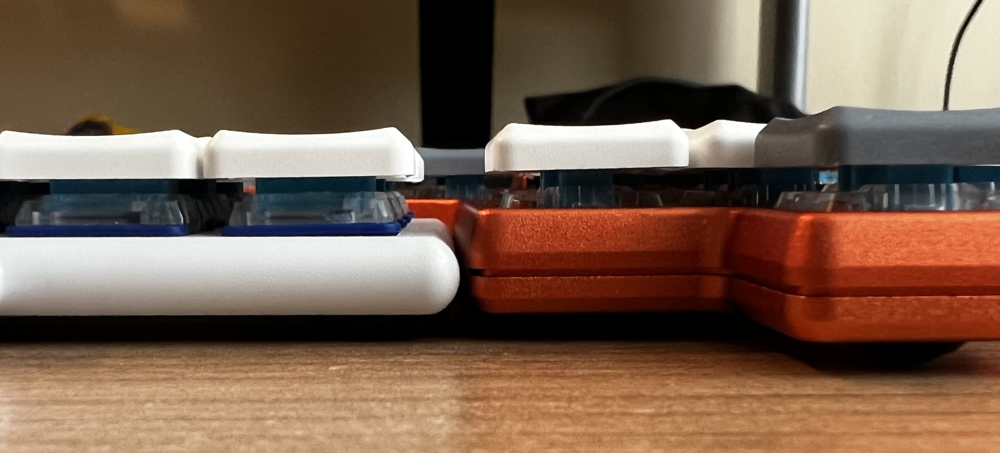
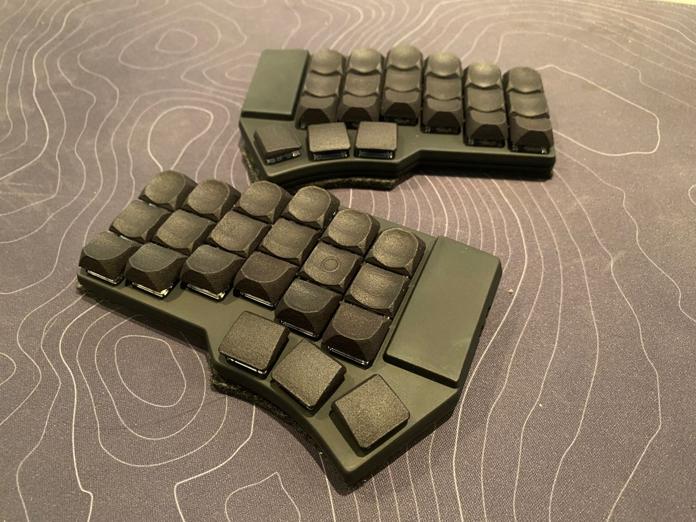

# DaoShield

Dao Shield is a case for Dao Choc BLE. It is designed specifically for CNC, so problems may arise when printing on a 3d printer.

Available in 44 and 42 key variants

- [Dao Choc BLE](https://github.com/yumagulovrn/dao-choc-ble) by [Rafael Yumagulov](https://github.com/yumagulovrn) 

# Fixing switches

The case plate differs from the standard ones. First, the switches are attached to the board and only then the plate is closed. 
I see advantages in this structure. When replacing switches, you do not need to scratch the plate. Also, the replacement is more convenient. 
In the case, the switches stand firmly, as they are clamped on both sides, by the board and the case.
Standard keycaps such as MBK are excellent in height. But the LDSA format will not work, as it will beat the walls against the case.

# Inspiration

When designing the case, I was inspired by - [Corne ish zen](https://github.com/LOWPROKB/zmk-config-Corne-ish-Zen) by [Darryldh](https://github.com/Darryldh)

Dao Shield is thicker than corne ish zen. But if you count from the bottom to the keycap, then the height is almost the same.

# Printing case

I had experience with only one printed case. I ordered it from jlc, SLA(resin) material. Since in some places the wall thickness is 1 mm, the case is quite elastic. In order to prevent this, you can add several cutouts for the screws. You can also order from MJF material, it will be stronger.

It should be borne in mind that there are screw cutouts in the case itself and frequent opening of the plastic case can spoil them. In the future, I'm thinking of enlarging the hole so that I can put a [screw insert](https://aliexpress.ru/item/4000232925592.html?sku_id=10000000945438228). But it will be necessary to test.

In general, the case made in jlc is quite beautiful and suitable for temporary use.

# Board thickness

The case is made specifically for ready made keyboards, which have different board thicknesses. Therefore, all standard pcb ones from 0.8mm to 1.6 are suitable, but I would recommend a thickness of 1.2.

# Contacts

Telegram channel: https://t.me/mposibl
Telegram chat: https://t.me/mposibleee
Discord: Nechto#1284
