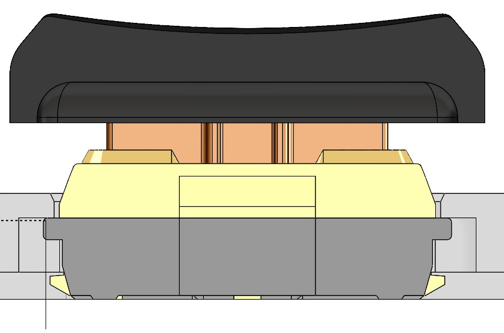

# DaoShield

Dao Shield is a case for Dao Choc BLE. It is designed specifically for CNC, so problems may arise when printing on a 3d printer.

Available in 44 and 42 key variants

- [Dao Choc BLE](https://github.com/yumagulovrn/dao-choc-ble) by [Rafael Yumagulov](https://github.com/yumagulovrn) 

# Fixing switches

The case plate differs from the standard ones. First, the switches are attached to the board and only then the plate is closed. 
I see advantages in this structure. When replacing switches, you do not need to scratch the plate. Also, the replacement is more convenient. 
In the case, the switches stand firmly, as they are clamped on both sides, by the board and the case.
Standard keycaps such as MBK are excellent in height. But the LDSA format will not work, as it will beat the walls against the case.
